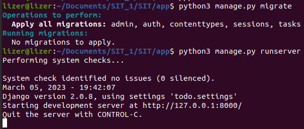

# Отчёт
- Установка docker и docker-compose:

```bash
sudo apt install docker docker-compose
```

## Создание Django проекта:

Возьмем готовый простой Django [проект](https://github.com/OmkarPathak/Django-to-do)

1. Установим зависимости:
```bash
pip install -r requirements.txt
```
2. Запустим проект:
```bash
python3 manage.py migrate
python3 manage.py runserver
```


## Создание Dockerfile:
- За основу возьмём `python3.8.10`
- Определим интересующие нас файлы, скопируем их внутрь image, установим необходимые зависимости
## Создание docker-compose.yml:
- Определим в папке `/nginx` конфигурацию `local.conf`
- 